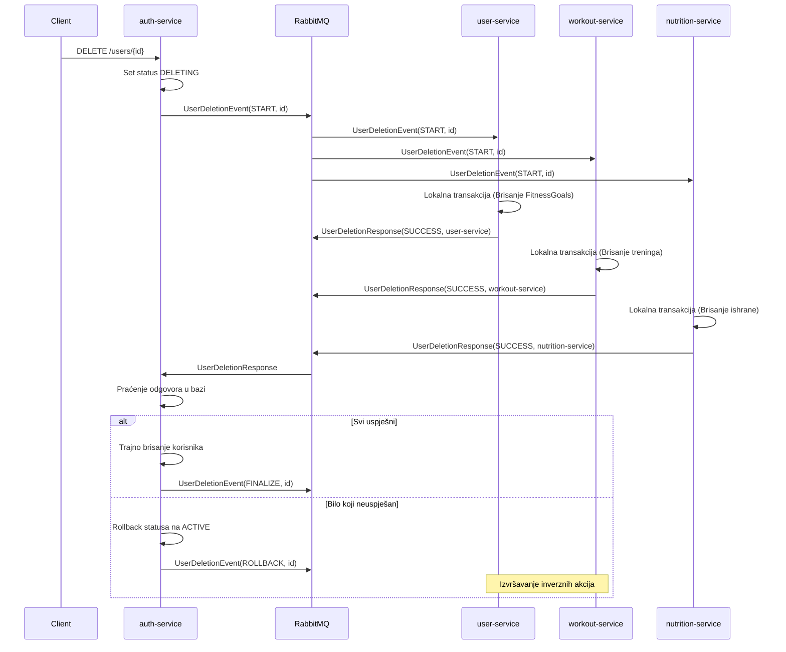

# Implementacija Saga Choreography obrasca (Brisanje korisnika)

Ovaj dokument opisuje asinkronu komunikaciju implementiranu pomoću RabbitMQ-a za funkcionalnost brisanja korisnika koristeći Saga Choreography obrazac.

## Opis procesa

Kada se zatraži brisanje korisnika u `auth-service`, sistem ne vrši odmah trajno brisanje. Umjesto toga, pokreće se Saga proces koji osigurava konzistentnost podataka kroz više mikroservisa.

1.  **Inicijacija**: `auth-service` postavlja status korisnika na `DELETING` i šalje poruku `UserDeletionEvent` (tip: `START`) na RabbitMQ exchange.
2.  **Paralelna obrada**:
    *   `user-service` prima poruku i briše fitness ciljeve (`FitnessGoal`) povezane s tim korisnikom. Nakon završetka šalje `UserDeletionResponseEvent` (SUCCESS ili FAILURE).
    *   `workout-service` prima poruku i briše planove treninga i odrađene treninge. Nakon završetka šalje `UserDeletionResponseEvent` (SUCCESS ili FAILURE).
    *   `nutrition-service` prima poruku i briše logove obroka i podatke o napretku. Nakon završetka šalje `UserDeletionResponseEvent` (SUCCESS ili FAILURE).
3.  **Koordinacija**: `auth-service` sluša odgovore.
    *   Ako **svi** servisi jave `SUCCESS`, `auth-service` trajno briše korisnika iz svoje baze i šalje `FINALIZE` događaj.
    *   Ako **bilo koji** servis javi `FAILURE`, `auth-service` vraća status korisnika na `ACTIVE` i šalje `ROLLBACK` događaj svim učesnicima kako bi mogli izvršiti kompenzacijske akcije.

## Dijagram toka

## Tehnički detalji

*   **Tehnologija**: Spring Boot AMQP (RabbitMQ).
*   **Exchange**: `TopicExchange` (omogućava fleksibilno usmjeravanje poruka).
*   **Konzistentnost**: Eventual consistency.
*   **Inverzne akcije**: Implementirane kroz `ROLLBACK` tip događaja u listenerima.

## Kako testirati

1. Pokrenuti RabbitMQ putem `docker-compose up rabbitmq`.
2. Pokrenuti servise.
3. Pozvati endpoint za brisanje korisnika u `auth-service`.
4. Pratiti logove servisa kako biste vidjeli razmjenu poruka i lokalne transakcije.
