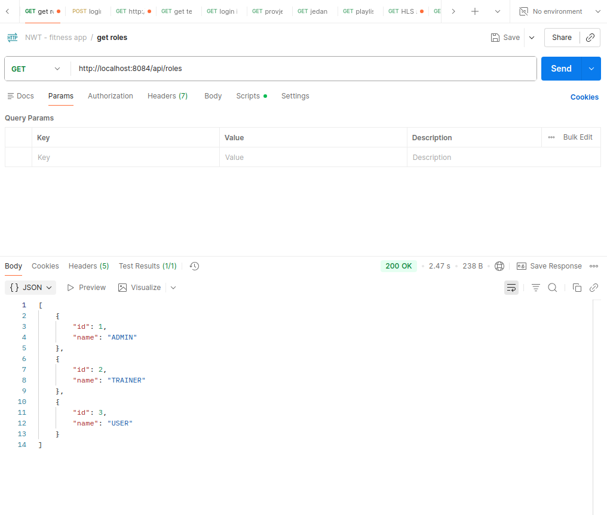
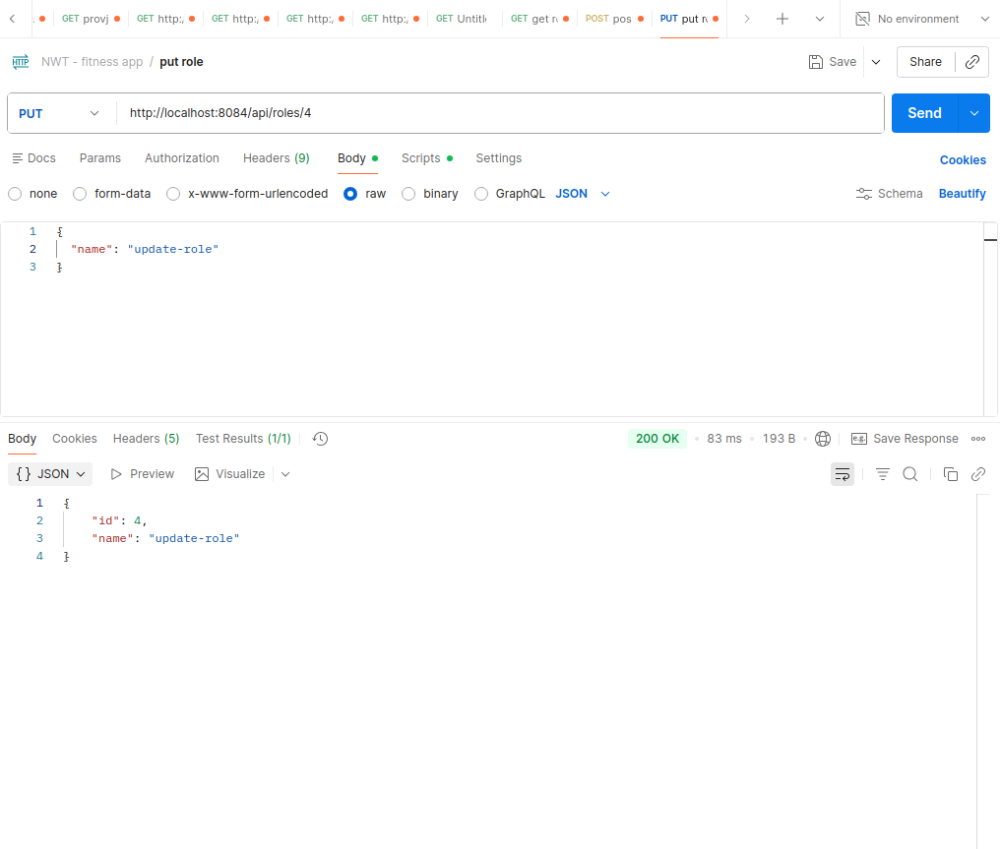
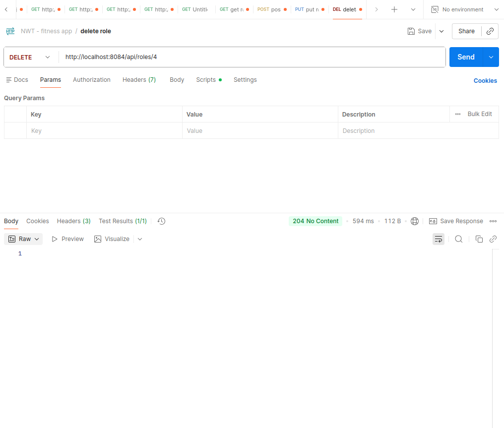

# Auth Service API

## Svrha servisa
`auth-service` upravlja korisnicima i ulogama koje se koriste za autentikaciju i autorizaciju u sustavu. Servis cuva osnovne korisnicke podatke, hash lozinke i vezu korisnika prema roli.

## Base URL
`http://localhost:8084`

## Endpoint tabela

### Roles

| Method | Path | Opis |
| --- | --- | --- |
| GET | `/api/roles` | Vraca sve role. |
| GET | `/api/roles/{id}` | Vraca jednu rolu po ID-u. |
| POST | `/api/roles` | Kreira novu rolu. |
| PUT | `/api/roles/{id}` | Azurira postojecu rolu. |
| DELETE | `/api/roles/{id}` | Brise rolu. Vraca `204 No Content`. |

### Users

| Method | Path | Opis |
| --- | --- | --- |
| GET | `/api/users` | Vraca sve korisnike. |
| GET | `/api/users/{id}` | Vraca jednog korisnika po ID-u. |
| POST | `/api/users` | Kreira novog korisnika. |
| PUT | `/api/users/{id}` | Azurira postojeceg korisnika. |
| DELETE | `/api/users/{id}` | Brise korisnika. Vraca `204 No Content`. |

## Primjer request/response (success)

### POST `/api/roles`

Request:

```json
{
  "name": "ADMIN"
}
```

Response `201 Created`:

```json
{
  "id": 1,
  "name": "ADMIN"
}
```

### POST `/api/users`

Request:

```json
{
  "username": "marko",
  "email": "marko@example.com",
  "passwordHash": "$2a$10$exampleHashValue",
  "roleId": 1
}
```

Response `201 Created`:

```json
{
  "id": 10,
  "username": "marko",
  "email": "marko@example.com",
  "roleName": "ADMIN",
  "createdAt": "2026-05-14T10:30:00"
}
```

## Primjer request/response (error)

### POST `/api/users`

Request:

```json
{
  "username": "marko",
  "email": "neispravan-email",
  "passwordHash": "",
  "roleId": null
}
```

Response `400 Bad Request`:

```json
{
  "status": 400,
  "error": "VALIDATION_ERROR",
  "message": "Validation failed",
  "timestamp": "2026-05-14T10:31:00",
  "fieldErrors": [
    "email: Email must be a valid email address",
    "passwordHash: Password hash must not be blank",
    "roleId: Role ID must not be null"
  ]
}
```

## Validacijska pravila

| DTO | Pravila |
| --- | --- |
| `RoleRequest` | `name` je obavezan, ne smije biti prazan, max `50` znakova. |
| `UserRequest` | `username` je obavezan, ne smije biti prazan, max `100` znakova. |
| `UserRequest` | `email` je obavezan, mora biti validan email, max `150` znakova. |
| `UserRequest` | `passwordHash` je obavezan, ne smije biti prazan, max `255` znakova. |
| `UserRequest` | `roleId` je obavezan i mora biti `Long`. |

## Error format

Svi error response payloadi koriste isti JSON format:

```json
{
  "status": 400,
  "error": "VALIDATION_ERROR",
  "message": "Validation failed",
  "timestamp": "2026-05-14T10:31:00",
  "fieldErrors": [
    "email: Email must be a valid email address"
  ]
}
```

Napomene:

- `fieldErrors` postoji samo kod validacijskih gresaka.
- `error` moze biti `VALIDATION_ERROR`, `NOT_FOUND`, `CONFLICT` ili `INTERNAL_ERROR`.
- `404` se koristi za nepostojeci resurs, `409` za duplikat, `500` za neocekivanu gresku.

# Screenshots
## GET /api/roles


## GET /api/roles/{id}


## POST /api/roles


## PUT /api/roles/{id}


## DELETE /api/roles/{id}


## GET /api/users


## GET /api/users/{id}


## POST /api/users


## PUT /api/users/{id}


## DELETE /api/users/{id}

